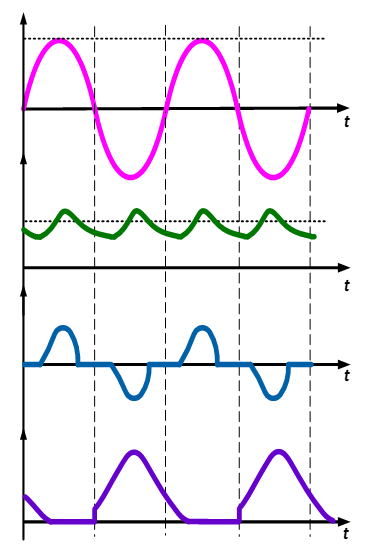

### Theory

  
  
Fig. 1. Circuit diagram of diode bridge rectifier.

 
Diode bridge rectifier circuit operates in two modes: (a) Positive half cycle of input ac voltage and (b) Negative half cycle of input ac voltage. Brief description of these modes can easily be understood from the equivalent circuits given below.
  

<table border="0" align="center" style="width:100%; border:none;">
  <tr>
<td style="width:50%">

  

  
Fig. 2(a). Positive-half cycle.
  

</td>
<td style="width:50%">
  

  
Fig. 2(b). Negative-half cycle.
  

 
    </td>
  </tr>
</table>
 

 
During the positive half-cycle of the AC input voltage, diodes ‘D1’ and ‘D2’ are conducting and the power is supplied to the load while in the negative half-cycle diodes ‘D3’ and ‘D4’ are conducting. The steady-state waveforms of the output voltage (Vo), input current (Iin) and diode voltage (VD1) are shown in Fig. 3. The output load voltage is pulsating DC superimposed with ac ripple.
  

  
  
Fig. 3. Circuit diagram of diode bridge rectifier with LC filter.

 

<table border="0" align="center" style="width:100%; border:none;">
  <tr>
<td style="width:50%">

  

  
(a) Waveforms without filter.
  

</td>
<td style="width:50%">
  

  
(b) Waveforms with LC-filter.
  

 
    </td>
  </tr>
  <tr>
    <td colspan="2" >
      
Fig.4. Steady-state waveform of diode bridge rectifier.

    </td>
  </tr>
</table>
 
 

The nth harmonic ripple current has to pass through the filter capacitor for which the load impedance has to be greater than the filter capacitor impedance, i.e.

 

  

    ..(1)

 

 
Assume the following to satisfy this relation
  

  
      

    ..(2)

 
From the above expression the value of capacitor filter can be calculated:

 
  
      

    ..(3)

 
The Fourier series of the output voltage with RL load is:
 

  
      

    ..(4)

 
The DC component is:

 
  
      

    ..(5)

 

 
and the AC component is:

 
  
      

    ..(6)

The above equation is simplified by considering only the dominant harmonics, second harmonic is the dominant one and its rms value is 

  
      

    ..(7)

 
Therefore

  
      

    ..(8)

 
The load voltage expression is:

  
      

    ..(9)

 
Assume the ripple factor and obtain the value of filter inductor  
Let RF = 0.1 

  
      

    ..(10)

 
Use the value of Cf and compute Lf using eq.(3) and eq.(10). The LC-filter based single phase diode bridge rectifier with RL load is ready to perform the experiment and its steady-state waveforms are shown in Fig. 3.  
The output current Idc can easily be computed as:

  
      

    ..(11)

 
The output power (P) can easily be computed as:

  
      

    ..(12)

